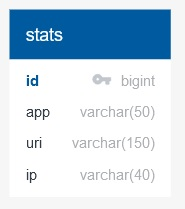

# java-explore-with-me
ссылка на pull request: https://github.com/DenisenkoMax/java-explore-with-me/pull/2

    Приложение ExploreWithMe (англ. «исследуй со мной»).
Приложение дает возможность делиться информацией об интересных событиях и помогать найти компанию для участия в них.

    Идея
Свободное время — ценный ресурс. Ежедневно мы планируем, как его потратить — куда и с кем сходить.
Сложнее всего в таком планировании поиск информации и переговоры. Какие намечаются мероприятия, свободны
ли в этот момент друзья, как всех пригласить и где собраться. ПриложениеExploreWithMe — афиша,
где можно предложить какое-либо событие от выставки до похода в кино и набрать компанию для участия в нём.

    Приложение состоит из двух сервисов:
Основной сервис — содержит всё необходимое для работы продукта.
Сервис статистики — хранит количество просмотров и позволяет делать различные выборки для анализа работы приложения.

    Основной сервис
API основного сервиса разделите на три части. 
Первая — публичная, доступна без регистрации любому пользователю сети.
Вторая — закрытая, доступна только авторизованным пользователям.
Третья — административная, для администраторов сервиса. К каждой из частей свои требования.

    Сервис статистики
Второй сервис, статистики, призван собирать информацию. Во-первых, о количестве обращений пользователей к спискам
событий и, во-вторых, о количестве запросов к подробной информации о событии. На основе этой информации должна
формироваться статистика о работе приложения.

    Спецификация API
спецификация основного сервиса:
ewm-main-service-spec.json

спецификация сервиса статистики:
ewm-stats-service-spec.json

    Схема данных сновного сервиса:

    Схема данных сновного сервиса статистики:
